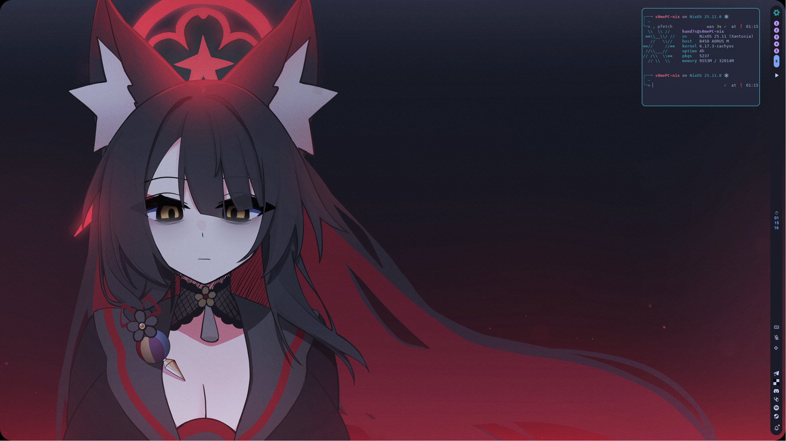

  

  

<h1 align="center"> re:Nixos  </h1>

  
  **re:Nixos**  is fork of my private repository for public eyes.  
  **re:Nixos**  won't be archived and left unupdated as **myNixConf**, since it's my actual system.  
  **re:Nixos**  exist on both [GitHub](https://github.com/s0me1newithhand7s/reNixos/)   and [GitLab](https://gitlab.com/s0me1newithhand7s/reNixos/) . 

  Treeview ([Obsidian](https://obsidian.md/) canvases) are avaiable under `doc/` directory.  
  - flake-tree - `doc/flake-tree.canvas` - explains how inputs and outputs works inside my `flake.nix`.  
  - hand7s-tree - `doc/hand7s-tree.canvas` - schema for my `home-manager`.  
  - s0mePC-tree - `doc/s0mePC-tree.canvas` - schema for my PC config.  
  - s0melapt0p-tree - `doc/s0melapt0p-tree.canvas` - schema for my laptop config.  

  AI review (in case you care) avaiable [here](https://deepwiki.com/s0me1newithhand7s/reNixos/5-development-workflow), but take this with a **big** grain of salt, since AI is AI.
 

  <h3 align="center">Special Thanks: </h3>

  [TheMaxMur](https://maxmur.info/) :star:

  [Askhalion](https://github.com/aski425) :star:

  [kotudemo](https://github.com/kotudemo) :star:

  [Vimjoyer](https://github.com/vimjoyer) and his fanbase! :star:

  without you, guys, this all might not see the light of day.
  

