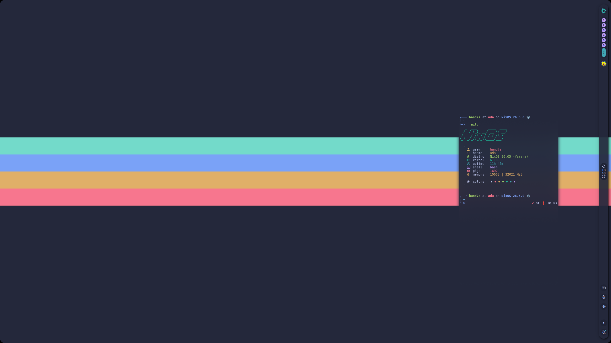

  

  

  

<h1 align="center"> re:Nixos  </h1>

  
  **re:Nixos**  is fork of my private repository for public eyes.  
  **re:Nixos**  won't be archived and left unupdated as **myNixConf**, since it's my actual system.  
  **re:Nixos**  exist on: [GitHub](https://github.com/s0me1newithhand7s/reNixos/)  and my [Forgejo](https://git.hand7s.org/s0me1newithhand7s/reNixos) . 

  <h3 align="center">Special Thanks: </h3>

  [TheMaxMur](https://maxmur.info/) :star:

  [Askhalion](https://github.com/aski425) :star:

  [kotudemo](https://github.com/kotudemo) :star:

  [Vimjoyer](https://github.com/vimjoyer) and his fanbase! :star:

  without you, guys, this all might not see the light of day.
  

